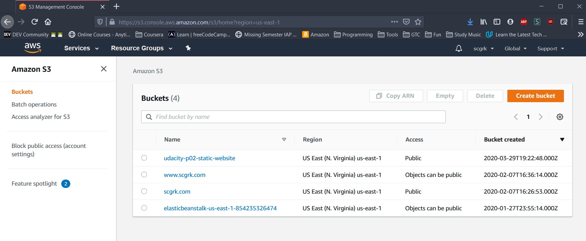
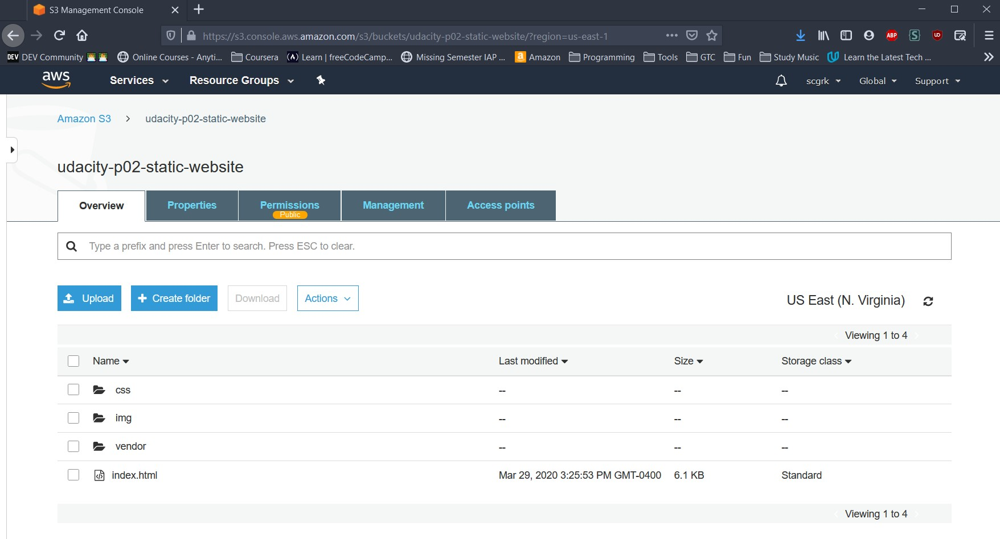
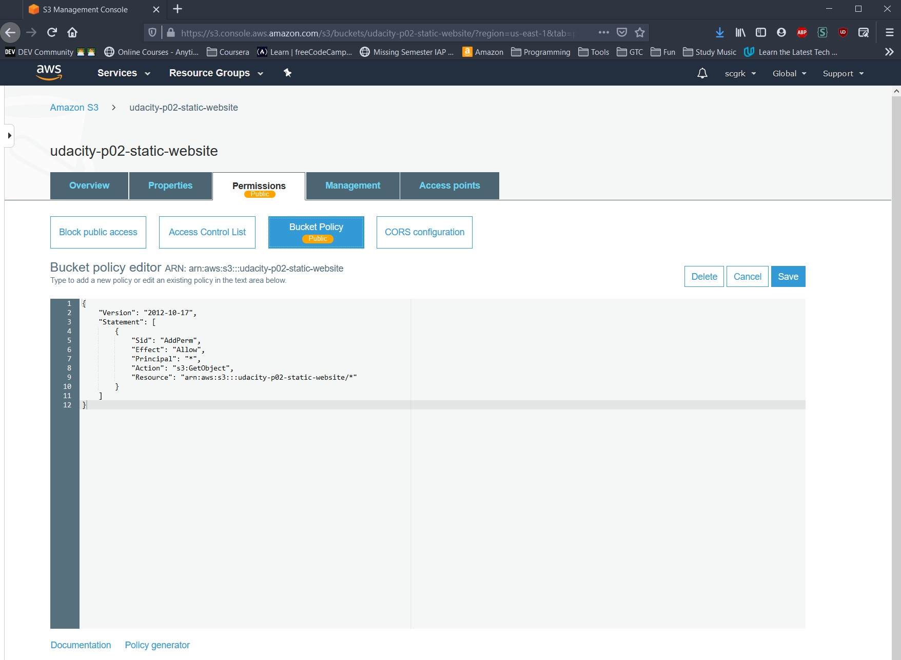
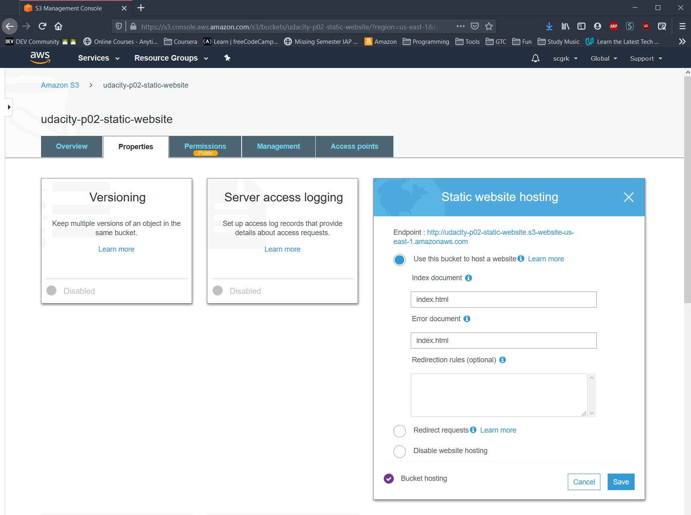
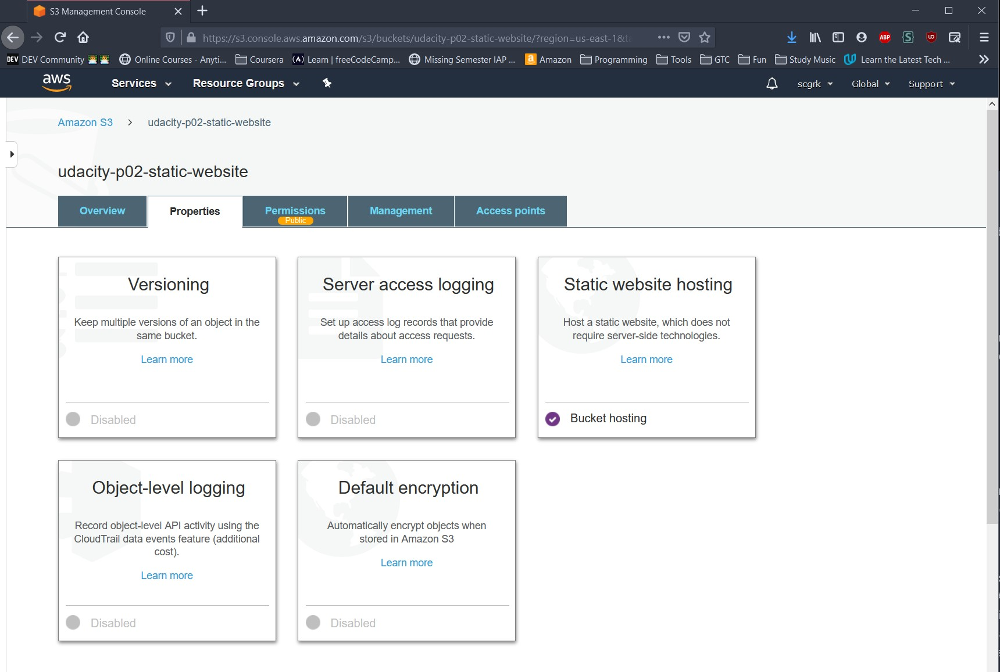
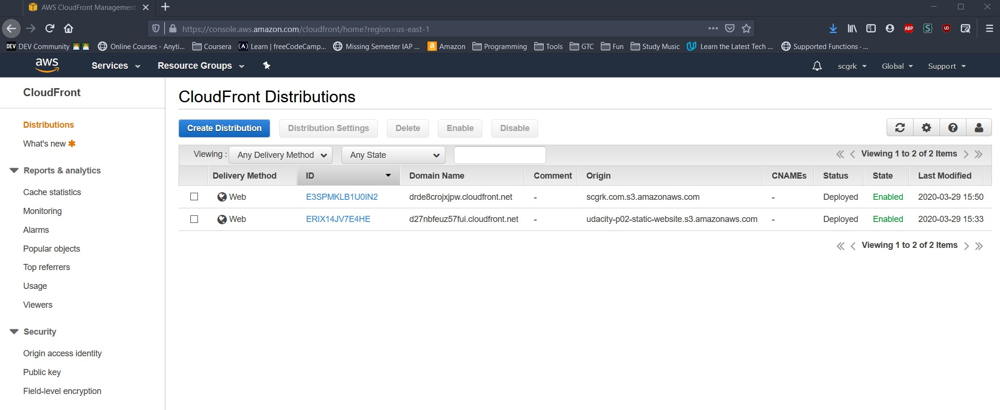

# Project: Deploy Static Website on AWS
CloudFront CDN URL: http://d27nbfeuz57fui.cloudfront.net/index.html

## Images
Create an S3 Bucket for the project

Upload the provided files to the bucket

Set a public bucket policy

Set the bucket properties for static hosting

Set up CloudFront CDN

Check the CDN endpoint is working

